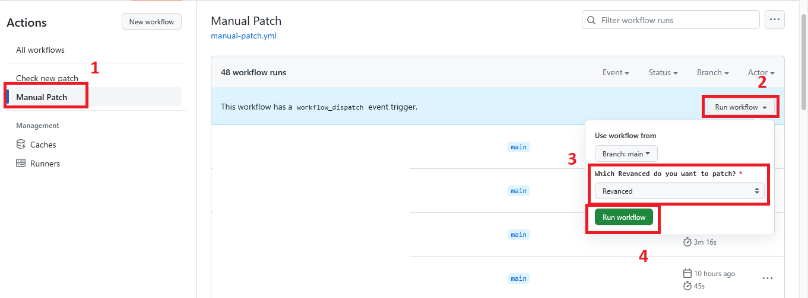

<h1 align="center">
   
      Frequently Asked Questions
   
</h1>

### Q: I'm facing a playback issue (Video stop loading after start 10-30s). How can I fix it?

The issue might be that your Android OS is preventing MicroG (GMS Core) from running in the background. Follow these instructions to resolve the problem.

[https://dontkillmyapp.com/](https://dontkillmyapp.com/)

---

### Q: How do I use this repository for patching my own app?

You should [fork](https://github.com/FiorenMas/Revanced-And-Revanced-Extended-Non-Root/fork) the repository, and then go to the `Action` tab

Click "I understand my workflows, go ahead and enable them"

Follow these steps to run the workflow for Manual Patch apps!

And then go to Readme click download your patched apps!

---

### Q: I want to use custom patches for patching my apps. How can I do it?

You should open the folder `Revanced-And-Revanced-Extended-Non-Root/src/patches/`. It contains a lot of folders that are named after the apps you’re patching. Each folder has two files: exclude-patches and include-patches. Edit these files with the patches you like, putting one patch per line, following the patches list here:

* For Revanced: https://github.com/revanced/revanced-patches
* For Revanced Extended: https://github.com/inotia00/revanced-patches/tree/revanced-extended
* For Revanced Extended Android 6 & 7: https://github.com/kitadai31/revanced-patches-android6-7/tree/revanced-extended

---

### Q: I want to use a custom file options.json. How can I do it?

You should open the folder [Revanced-And-Revanced-Extended-Non-Root/src/options/](../src/options). It contains files revanced-extended.json, anddea.json... edit those file the same as you would options.json

Revanced alias no longer use options.json anymore use directly `Revanced-And-Revanced-Extended-Non-Root/src/patches/` instead.

The options separate with patches name with `|`

Example Youtube apps include patches:

`Custom branding|-OappName="YouTube ReVanced" -OiconPath=ReVanced*Logo`

---

### Q: I am facing errors using your apps, what do I do?

I’m so sorry about this, but my repository only patches apps from “scripts” by other devs. I can’t fix errors when apps face errors, so if you get errors, please make an issue in [Revanced](https://github.com/revanced/revanced-patches), [Revanced Extended](https://github.com/inotia00/revanced-patches/tree/revanced-extended) or [Revanced Extended Android 6 & 7](https://github.com/kitadai31/revanced-patches-android6-7/tree/revanced-extended) repositories.

---

### Q: How do I know these apps are safe to use?

You can rest assured that it’s safe because my code is 100% open-source and uses GitHub Actions to patch the apps. The apk files used for patching are downloaded from the trusted site “APKMirror”.

----
